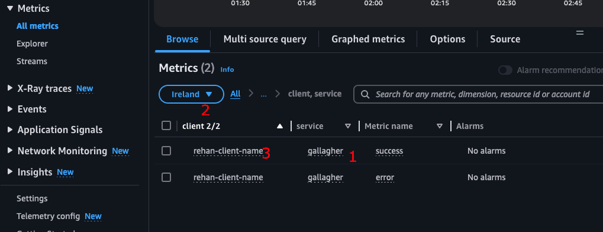

# Tailscale Lambda Proxy

[](https://badge.fury.io/js/tailscale-lambda-proxy) 
[](https://badge.fury.io/py/tailscale-lambda-proxy)

- [Tailscale Lambda Proxy](#tailscale-lambda-proxy)
  - [Why use a proxy?](#why-use-a-proxy)
  - [Usage](#usage)
    - [Installation](#installation)
  - [Accessing your Tailscale Network through the Proxy](#accessing-your-tailscale-network-through-the-proxy)
    - [Signing Requests](#signing-requests)
    - [Including Target Headers](#including-target-headers)
    - [Creating CloudWatch Tracking Metrics](#creating-cloudwatch-tracking-metrics)
    - [Error Handling](#error-handling)
    - [Code Examples](#code-examples)
  - [Additional Information](#additional-information)

A CDK construct that creates an AWS Lambda Function acting as a transparent proxy to your Tailscale network.

Available as both a TypeScript NPM Package and a Python PyPi Package:
- [TypeScript NPM Package](https://www.npmjs.com/package/tailscale-lambda-proxy)
- [Python PyPi Package](https://pypi.org/project/tailscale-lambda-proxy/)

## Why use a proxy?

The Proxy Lambda leverages the [Tailscale Lambda Extension](https://github.com/rehanvdm/tailscale-lambda-extension) CDK
construct.

It is recommended to use the Proxy Lambda to simplify connecting to your Tailscale network and reduces cold starts
by reusing the same Lambda function for all your Tailscale connected traffic.

Use the extension directly if:
- You have **a single Lambda** or service that needs to connect to your Tailscale network.
- You are comfortable with this Lambda having mixed responsibilities, such as connecting to Tailscale and running
  business logic.

Use the Proxy Lambda (recommended) if:
- You have **multiple Lambdas** or services requiring connection to your Tailscale network. The Proxy Lambda *eventually*
  creates a "pool of warm connections" to the Tailscale network, ready for use by other Lambdas.
- You want to separate responsibilities by having a dedicated Lambda for Tailscale connectivity.
- Authentication to the Tailscale network is handled at the IAM level, where access is granted to the Proxy Lambda's
  Function URL (FURL), instead of directly to the Tailscale API Secret Manager.

## Usage

> [!TIP]  
> Refer to the [tailscale-lambda-proxy-example](https://github.com/rehanvdm/tailscale-lambda-proxy-example) repository
> for a complete example.

### Installation

Install the package:  
```bash
npm install tailscale-lambda-proxy
```

The Proxy Lambda requires the following:
- `tsSecretApiKey`: The AWS Secrets Manager secret containing the Tailscale API Key as plain text.
- `tsHostname`: The "Machine" name as shown in the Tailscale admin console, which identifies the Lambda function(s).

```typescript
import * as cdk from 'aws-cdk-lib';
import { Construct } from 'constructs';
import { NodejsFunction } from "aws-cdk-lib/aws-lambda-nodejs";
import * as lambda from "aws-cdk-lib/aws-lambda";
import { TailscaleLambdaProxy } from "tailscale-lambda-proxy";
import * as secretsmanager from "aws-cdk-lib/aws-secretsmanager";

export class MyStack extends cdk.Stack {

  constructor(scope: Construct, id: string, props?: cdk.StackProps) {
    super(scope, id, props);

    const tailscaleProxy = new TailscaleLambdaProxy(this, "tailscale-proxy", {
      tsSecretApiKey: secretsmanager.Secret.fromSecretNameV2(this, "tailscale-api-key", "tailscale-api-key"),
      tsHostname: "lambda-test",
      // // Optional configuration
      // options: {
      //   extension: {
      //     layerVersionName: "tailscale-extension",
      //   },
      //   lambda: {
      //     functionName: "tailscale-proxy",
      //   }
      // }
    });

    const caller = new NodejsFunction(this, "tailscale-caller", {
      functionName: "tailscale-caller",
      runtime: lambda.Runtime.NODEJS_20_X,
      timeout: cdk.Duration.seconds(30),
      entry: "lib/lambda/tailscale-caller/index.ts",
      environment: {
        TS_PROXY_URL: tailscaleProxy.lambdaFunctionUrl.url,
      }
    });
    tailscaleProxy.lambdaFunctionUrl.grantInvokeUrl(caller); // Important! Allow the caller to invoke the proxy
    
  }
  
}
```

## Accessing your Tailscale Network through the Proxy

The [tailscale-lambda-proxy-example](https://github.com/rehanvdm/tailscale-lambda-proxy-example) repository contains
the following example.

The Tailscale Lambda Proxy is fully transparent. It forwards requests (path, method, headers, and body) to the machine
and returns the response without modification.

Key considerations when using the Proxy:
1. All requests must be signed with the IAM Signature V4 algorithm.
2. The target machine's IP address and port must be included in the headers when making requests to the Proxy.

### Signing Requests

The Proxy Lambda exposes a Function URL secured with IAM Authentication. The caller Lambda requires this URL and
IAM permissions to make requests. These requests must be signed with the IAM Signature V4 algorithm. For TypeScript,
use the [aws4](https://www.npmjs.com/package/aws4) package to sign requests.

### Including Target Headers

When calling the Proxy, include the following headers to specify the target machine:
- `ts-target-ip`: The IP address of the Tailscale-connected machine/device.
- `ts-target-port`: The port of the Tailscale-connected machine/device.

These `ts-` headers are removed before the request is forwarded to the target machine.

### Creating CloudWatch Tracking Metrics

To enable optional tracking metrics, add the following headers to your request:
- `ts-metric-service`: The name of the service or API making the request.
- `ts-metric-dimension-name`: The dimension name for tracking (such as client name).
- `ts-metric-dimension-value`: The value associated with the dimension.

Metrics generated in CloudWatch:
- `success`: Logged when a request reaches the target server, regardless of the API response status.
- `failure`: Logged when a request fails to reach the target server, typically due to network issues or server
  unavailability.

Example headers for a request:
- `ts-metric-service`: `gallagher`, indicating the service or API making the request.
- `ts-metric-dimension-name`: `client`, used for monitoring or alerts.
- `ts-metric-dimension-value`: `rehan-test-client`, identifying the specific client.

This configuration generates CloudWatch metrics similar to the screenshot below:  



### Error Handling

To maintain transparency, the Proxy Lambda passes all traffic, including errors, back to the caller. This approach
makes it difficult to determine whether an error originated from the Proxy Lambda or the Tailscale-connected machine.

A Proxy Lambda error can be identified by the following headers in the response:
- `ts-error-name`: The error name.
- `ts-error-message`: The error message.

### Code Examples

Refer to the [tailscale-lambda-proxy-example](https://github.com/rehanvdm/tailscale-lambda-proxy-example) repository
for the complete example. The partial snippet below shows a Lambda function accessing an express server running
on a Tailscale-connected machine. The [TailscaleProxyApi](https://github.com/rehanvdm/tailscale-lambda-proxy-example/blob/f5e95c9b2294bd185bbe5b372a24dafcafc17297/lib/lambda/tailscale-caller/tailscale-proxy-api.ts) 
class implements the above-mentioned usage specifications.

```typescript
import {TailscaleProxyApi} from "./tailscale-proxy-api";

export const handler = async (event: any) => {
  console.log(JSON.stringify(event, null, 2));

  // Connect to the tailscale network with your laptop, get your tailscale IP, then start the express server in
  // `express-local-api` with `npm run start` and then run the lambda function to test the connection.
  const targetIp = "100.91.164.93";
  const targetPort = 3000;

  const api = new TailscaleProxyApi(process.env.TS_PROXY_URL!, process.env.AWS_REGION!,
    targetIp, targetPort,
    "express-local-api", "client", "client-a"
    );

  const resp = await api.request("/ping", "GET");

  if(resp.proxyError) {
    throw new Error(`PROXY ERROR: ${resp.proxyError}`);
  }
  else if(resp.response.statusCode !== 200) {
    throw new Error(`API ERROR: ${resp.response.statusCode} with body: ${resp.response.body}`);
  }

  console.log('');
  console.log('API SUCCESS: ', resp.response.body);

  return true;
};
```

## Additional Information

Refer to the [Tailscale Lambda Extension](https://github.com/rehanvdm/tailscale-lambda-extension) documentation for:
- Configuring Tailscale.
- Understanding limitations such as cold start times, package sizes, and the lack of DNS resolution.
- Additional implementation details.
